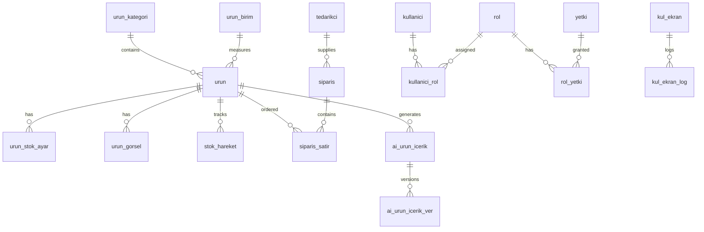

# Veritabanı Tasarımı

## ER Diyagramı

## Tablo Açıklamaları

### Ürün Modülü

| Tablo | Açıklama | Önemli Alanlar |
|-------|----------|----------------|
| `urun` | Ana ürün tablosu | urun_kod, urun_adi, barkod |
| `urun_kategori` | Hiyerarşik kategoriler | ust_kategori_id (self-ref) |
| `urun_birim` | Ölçü birimleri | birim_kod (ADET, KG, LT) |
| `urun_stok_ayar` | Stok limitleri | min_stok, kritik_stok |
| `urun_gorsel` | Ürün fotoğrafları | gorsel_path, ana_gorsel |

### Stok Modülü

| Tablo | Açıklama | Önemli Alanlar |
|-------|----------|----------------|
| `stok_hareket` | Tüm stok hareketleri | hareket_tip (GIRIS/CIKIS), miktar |

### Sipariş Modülü

| Tablo | Açıklama | Önemli Alanlar |
|-------|----------|----------------|
| `tedarikci` | Tedarikçi bilgileri | tedarikci_kod, yetkili |
| `siparis` | Sipariş başlığı | durum, toplam_tutar |
| `siparis_satir` | Sipariş kalemleri | miktar, birim_fiyat, teslim_miktar |

### AI Modülü

| Tablo | Açıklama | Önemli Alanlar |
|-------|----------|----------------|
| `ai_urun_icerik` | AI üretilen içerikler | durum (TASLAK/AKTIF), provider |
| `ai_urun_icerik_ver` | İçerik versiyonları | versiyon_no |

### Yetki Modülü

| Tablo | Açıklama | Önemli Alanlar |
|-------|----------|----------------|
| `kullanici` | Kullanıcılar | kullanici_adi, sifre_hash |
| `rol` | Roller | rol_kod (ADMIN, KULLANICI) |
| `yetki` | Yetkiler | yetki_kod, modul |

### Sistem Modülü

| Tablo | Açıklama | Önemli Alanlar |
|-------|----------|----------------|
| `kul_ekran` | Ekran tanımları | ekran_kod, menudeki_adi |
| `kul_ekran_log` | Ekran açılış logları | versiyon |
| `bildirim` | Sistem bildirimleri | bildirim_tip, okundu |
| `audit_log` | Değişiklik logları | tablo_adi, islem_tip |

## Veri Tipleri Standardı

| Kullanım | SQL Tipi |
|----------|----------|
| Primary Key | INT IDENTITY(1,1) |
| Kod alanları | NVARCHAR(20-50) |
| İsim alanları | NVARCHAR(100-200) |
| Açıklama | NVARCHAR(MAX) |
| Para birimi | DECIMAL(18,2) |
| Miktar | DECIMAL(18,2) |
| Boolean | BIT DEFAULT 1 |
| Tarih | DATETIME DEFAULT GETDATE() |
